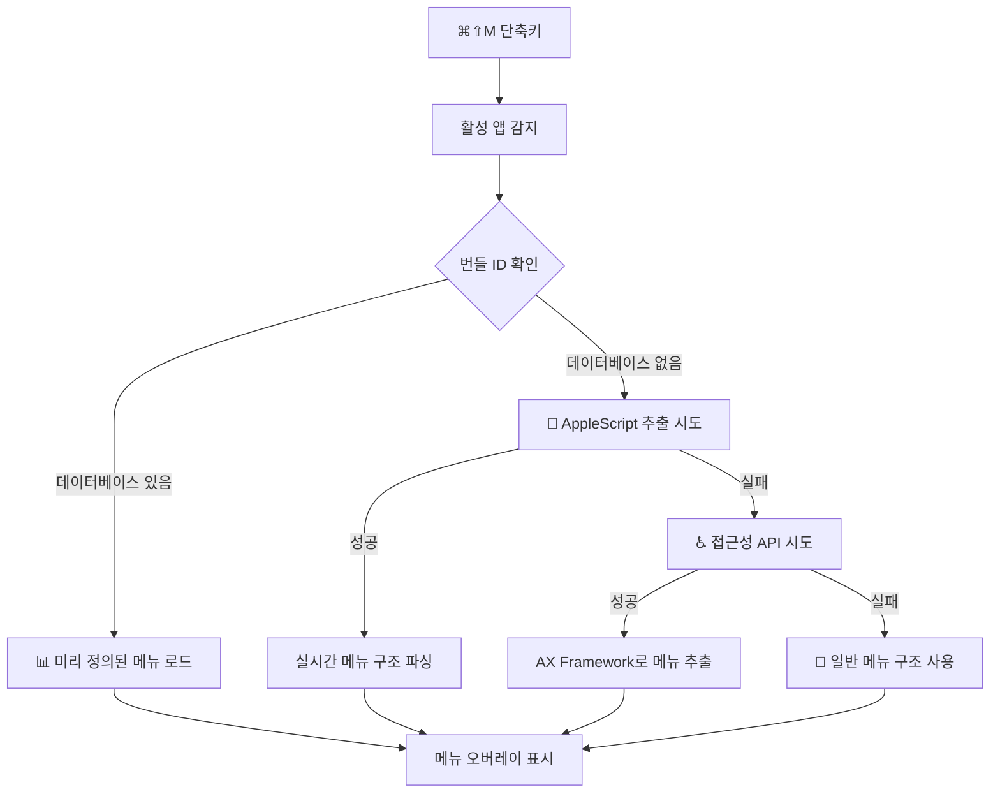

# 🚀 hotMenuBar

**macOS 메뉴바에 키보드 단축키로 빠르게 접근하는 생산성 도구**

⌘⇧M 단축키로 현재 활성 앱의 메뉴바를 화면 중앙에 오버레이로 표시하여, 마우스를 상단으로 움직이지 않고도 모든 메뉴 기능에 즉시 접근할 수 있습니다.

---

## ✨ 주요 기능

### 🎯 **스마트 메뉴 감지 시스템**
- **📊 메뉴 데이터베이스**: 주요 macOS 앱들의 완전한 메뉴 구조 미리 정의
- **🔧 AppleScript 실시간 추출**: 시스템 이벤트를 통한 동적 메뉴 정보 수집
- **♿ 접근성 API 백업**: Accessibility Framework를 통한 대체 감지
- **🔄 자동 폴백**: 모든 방법이 실패한 경우 일반 메뉴 구조 제공

### ⚡ **빠른 접근**
- **⌘⇧M** 단축키로 즉시 메뉴 활성화
- 화면 중앙에 오버레이 표시로 시선 이동 최소화
- 직관적인 탭 네비게이션 (키보드/마우스 지원)

### 🎨 **현대적인 UI**
- SwiftUI 기반의 네이티브 macOS 디자인
- 부드러운 애니메이션과 전환 효과
- 다크/라이트 모드 자동 대응

---

## 🔒 Tech Stack  
- **macOS Security Framework, Accessibility API**  
- **Swift 6, SwiftUI 5, Xcode 17+**  
- **NSMenu, NSStatusItem, AXUIElement**  
- **AppleScript Integration, Carbon Framework**

---

## 📱 앱 호환성

### ✅ **완전 지원 (데이터베이스)**
- **Finder**: 파일 관리, 보기 옵션, 탐색 기능
- **TextEdit**: 문서 편집, 포맷팅, 텍스트 처리  
- **Preview**: 이미지/PDF 보기, 주석, 편집 도구
- **Calculator**: 계산기 모드, 변환 기능
- **Safari**: 브라우징, 북마크, 히스토리 관리

### ⚠️ **제한적 지원 (AppleScript/접근성)**
- **Chrome, Firefox**: 커스텀 UI로 인한 부분적 감지
- **VS Code, Sublime**: 일반 메뉴 구조로 대체
- **Adobe 제품군**: 복잡한 메뉴로 인한 기본 항목만 지원

### 🔧 **일반 메뉴 (폴백)**
- **Electron 앱들**: 기본 메뉴 구조 (파일, 편집, 보기, 윈도우, 도움말)
- **미지원 앱**: 표준 macOS 메뉴 패턴 제공

---

## 🚀 사용법

### 1️⃣ **설치 및 권한 설정**
1. 앱 실행 후 시스템 설정으로 이동
2. **개인정보 보호 및 보안 > 접근성**에서 hotMenuBar 허용
3. 접근성 권한은 더 정확한 메뉴 감지를 위해 권장됩니다

### 2️⃣ **기본 사용**
1. 원하는 앱을 실행하고 활성화
2. **⌘⇧M** 키를 눌러 메뉴 오버레이 열기
3. 탭으로 메뉴 그룹 선택 후 원하는 항목 클릭
4. **ESC** 키나 바깥 영역 클릭으로 닫기

### 3️⃣ **고급 기능**
- **키보드 탐색**: Tab/화살표 키로 메뉴 이동
- **빠른 실행**: 메뉴 항목 클릭 시 실제 앱에서 해당 기능 실행
- **실시간 감지**: 앱 전환 시 자동으로 해당 앱의 메뉴 로드

---

## 🏗️ 아키텍처

### 📁 **프로젝트 구조**
```
hotMenuBar/
├── 📱 hotMenuBarApp.swift          # 앱 진입점
├── 🖥️ ContentView.swift            # 메인 화면 & 디버깅 UI
├── 📂 Models/
│   └── MenuItem.swift              # 메뉴 데이터 모델
├── 🔧 Services/
│   └── MenuDataService.swift       # 하이브리드 메뉴 감지 시스템
├── ⌨️ Managers/
│   └── KeyboardShortcutManager.swift # 글로벌 단축키 관리
└── 🎨 Views/
    ├── MenuOverlayView.swift       # 메뉴 오버레이 컨테이너
    ├── MenuContainerView.swift     # 메뉴 레이아웃 관리
    ├── MenuGroupHeaderView.swift   # 탭 네비게이션
    ├── MenuItemListView.swift      # 메뉴 아이템 리스트
    └── MenuItemRowView.swift       # 개별 메뉴 아이템
```

### 🔄 **메뉴 감지 플로우**


---

## 💡 기술적 도전과 해결책

### **문제: macOS 메뉴바 접근 제한**
Apple은 보안상의 이유로 다른 앱의 메뉴바 직접 접근을 제한합니다.

### **해결: 하이브리드 접근법**
1. **데이터베이스 우선**: 주요 앱들의 메뉴 구조를 미리 분석하여 정적 데이터로 저장
2. **AppleScript 동적 감지**: System Events를 통해 실시간 메뉴 정보 추출
3. **접근성 API 백업**: AXUIElement로 가능한 경우 실제 메뉴 구조 파싱
4. **Graceful Degradation**: 모든 방법 실패 시 일반적인 macOS 메뉴 패턴 제공

---

## 🎯 향후 계획

### 📊 **메뉴 데이터베이스 확장**
- [ ] 더 많은 주요 앱 메뉴 구조 추가
- [ ] 사용자 정의 메뉴 패턴 지원
- [ ] 앱 버전별 메뉴 차이 대응

### 🔧 **감지 정확도 향상**
- [ ] AppleScript 최적화로 더 빠른 감지
- [ ] 앱별 특수 감지 로직 개발
- [ ] 메뉴 변경사항 자동 업데이트

### 🎨 **사용자 경험 개선**
- [ ] 키보드 전용 탐색 모드
- [ ] 메뉴 아이템 검색 기능
- [ ] 사용자 정의 단축키 설정

---

## 🔧 개발 환경

### **요구사항**
- macOS 12.0+ (Monterey)
- Xcode 15.0+
- Swift 6.0+

### **빌드 & 실행**
```bash
# 프로젝트 열기
open hotMenuBar.xcodeproj

# 또는 명령줄 빌드
xcodebuild -project hotMenuBar.xcodeproj -scheme hotMenuBar build
```

---

## 📄 라이선스

MIT License - 자유롭게 사용, 수정, 배포 가능합니다.

---

## 🤝 기여하기

버그 리포트, 기능 제안, 풀 리퀘스트 모두 환영합니다!

1. 이슈를 통해 문제 보고 또는 기능 제안
2. 새로운 앱의 메뉴 구조 데이터 기여
3. 코드 개선 및 최적화 제안

---

**hotMenuBar로 더 효율적인 macOS 워크플로우를 경험해보세요! 🚀**
